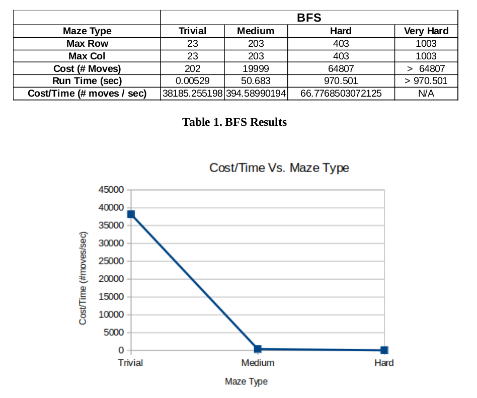
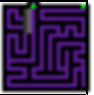
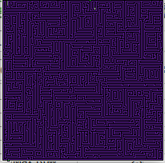
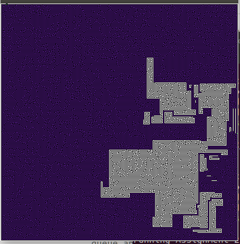
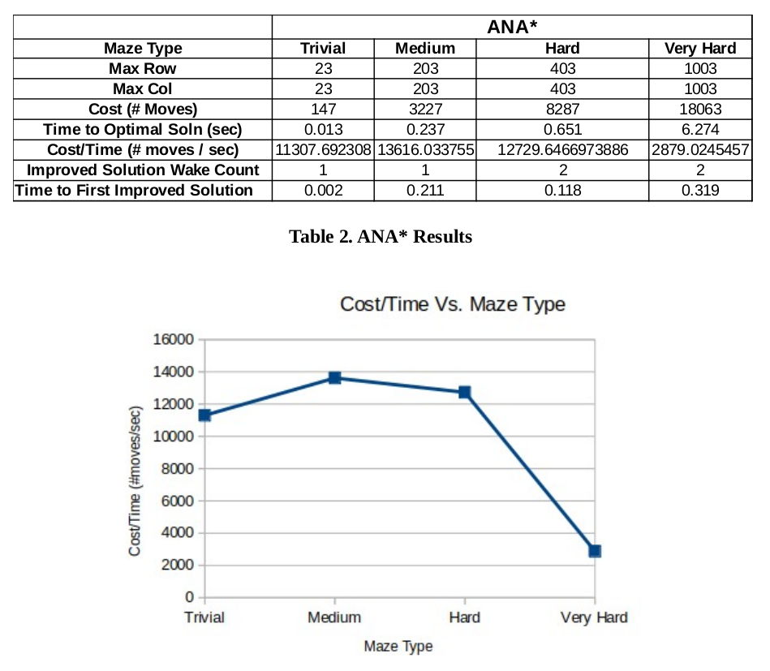
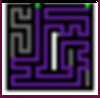
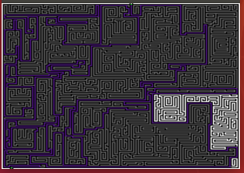
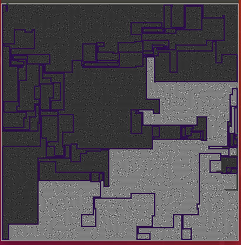
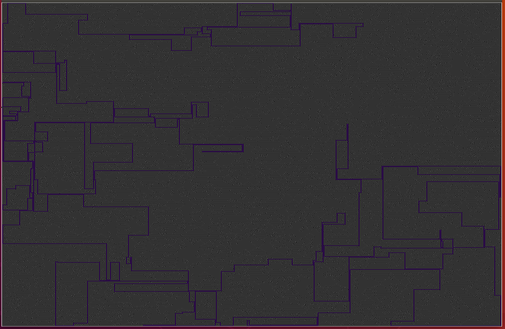

  
  
    

# Anytime Nonparametric A* (ANA) Algorithm
## Introduction
The Anytime Nonparametric A* (ANA*) algorithm is an A* variant resembling closest to the ARA* algorithm. The ANA* algorithm expands the open state s based on the following:  

    e(s) = (G – g(s)) / h(s)

This is exactly what makes ANA* different from ARA*. ARA* uses the following equation for the expansion of the open state s:  

    f(s) = g(s) + epsilon * h(s)

The epsilon parameter above gets set by the user and it usually increments in fixed amounts. The fine tuning of this parameter usually requires trial and error. This is the motivation behind the ANA* algorithm which removes the dependency of the algorithm based on user set parameters. In this experiment, two searching algorithms are compared. ANA* is compared against the Breadth-First-Search (BFS). Results are posted in the next section below. 

## Results
### BFS

It can be noticed from the figures below that as the maze complexity increases, the cost increases drastically. The cost function for BFS is O(V + E) where V represents vertices and E represents edges. It took approximately 970 seconds or 16 mins / 64807 moves to find a solution to the Hard Maze. It was taking over 1 hr and still was not able to find a solution for the Very Hard Maze after which the run of the code was interrupted.  
  

#### Trivial Maze
BFS Search Results for the Trivial Maze  
  

### Medium Maze
BFS Search Results for the Medium Maze  
  

### Hard Maze
BFS Search Results for the Hard Maze  
  

### ANA*

It can be noticed from the figures below that as the maze complexity increases, the cost function increase as well. ANA* implements heuristics which over time improves the cost to the optimal solution. We have to point out here that for the Hard and Very Hard Maze, the ANA* algorithm used the Improve Solution function twice. Based on these results, it can be observed for example for the Very Hard Maze that the initial sub-optimal solution was captured in 0.319 seconds and time to the optimal solution in 6.274 seconds with 18063 moves. Comparing these statistics to the Hard Maze of BFS (970 seconds or 16 mins / 64807 moves), it can be concluded that the ANA* is truly superior to the BFS. ANA* solved the Very Hard Maze (optimal solution) in 6.274 seconds with 18063 moves compared to BFS which took over 16 mins and over 64807 moves!  
  

#### Trivial Maze
ANA* Search Results for the Trivial Maze  
  

### Medium Maze
ANA* Search Results for the Medium Maze  
  

### Hard Maze
ANA* Search Results for the Hard Maze  
  

### Very Hard Maze
ANA* Search Results for the Very Hard Maze  
  

## Summary
In summary, the ANA* is superior to the BFS algorithm. The ANA* algorithm finds an initial solution way faster, converges to the optimal solution very fast, and it finds the goal state from the start state in the fewest number of moves.  

https://abedinsherifi.github.io/ANA-Star/
